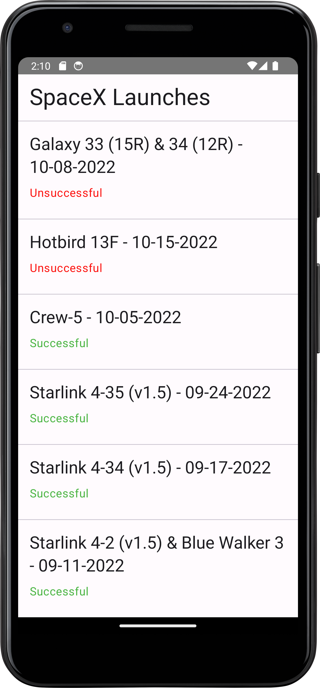
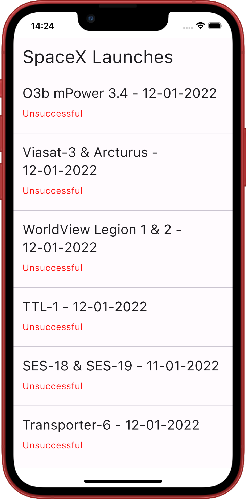
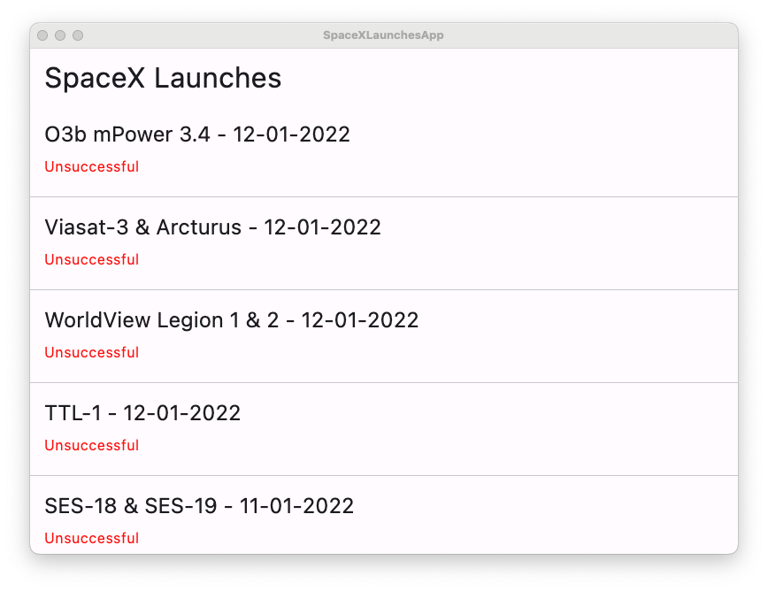

# SpaceX Launches App

## Overview
The SpaceX Launches App is a cross-platform application crafted with Kotlin utilizing Compose Multiplatform for the UI layer, Ktor for fetching launch history, and SqlDelight for local data storage.

## Features
- Browse through a list of SpaceX launches
- View launch details, including success status
- Save launch history locally for offline access

## Technologies Used
- **Compose Multiplatform**: A declarative framework for sharing UIs across multiple platforms using Kotlin.
- **Ktor**: A lightweight, asynchronous networking library designed by JetBrains for Kotlin. It's employed here to retrieve launch history from the [SpaceX API](https://api.spacexdata.com/v5/launches).
- **SqlDelight**: A Kotlin Multiplatform database library generating type-safe Kotlin APIs from SQL queries. It's utilized to locally store launch history.

## Screenshots

Android                      |  iOS
:---------------------------:|:--------------------:
   |            

Desktop
:------------------------:
 
